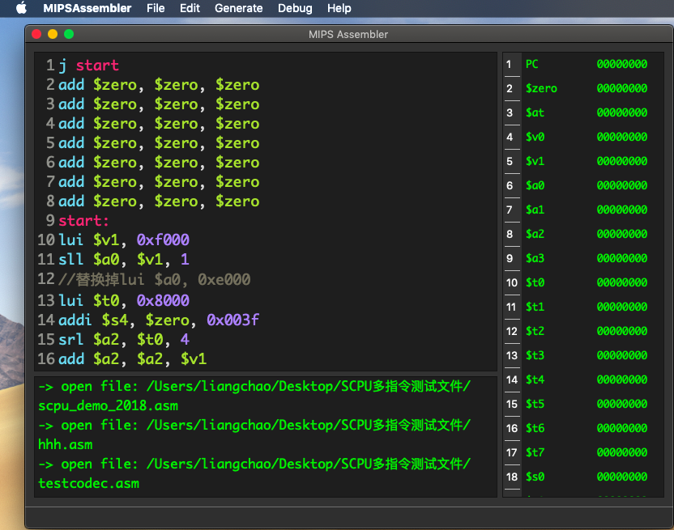
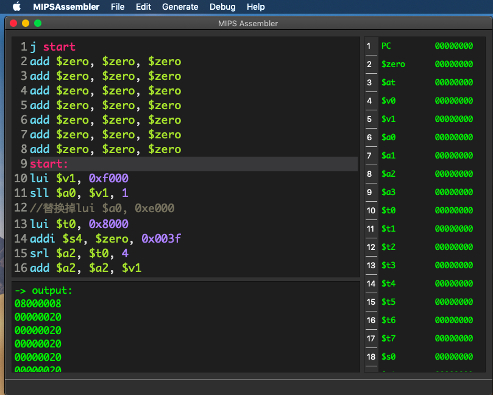
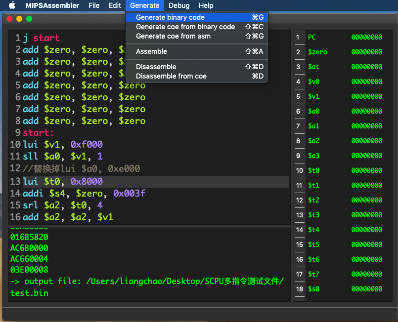
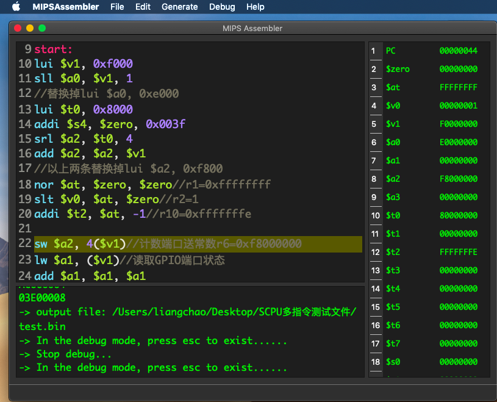
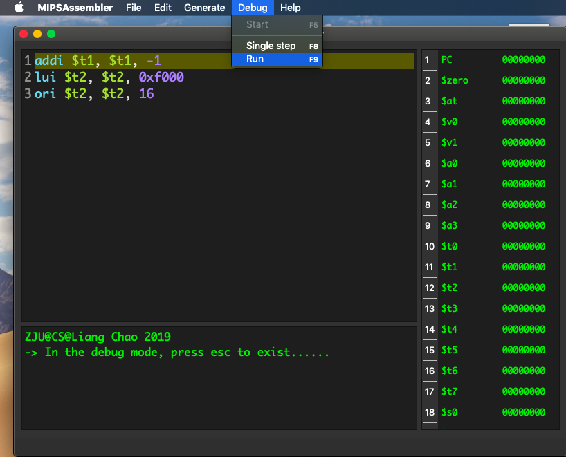
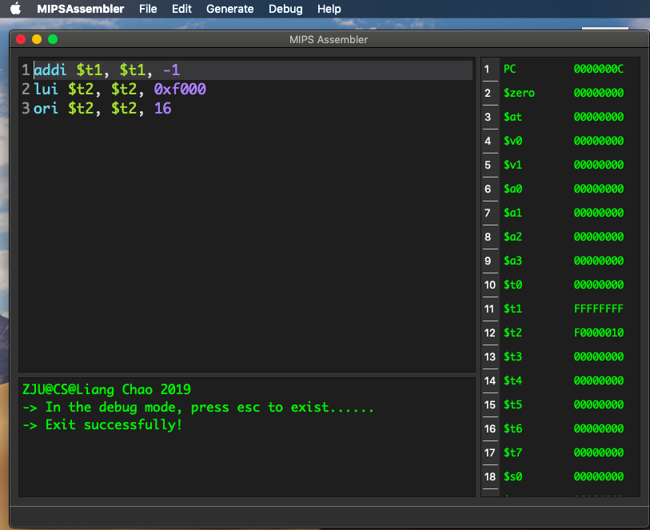

# MIPSAssembler

<p align = "center">

</p>


## Introduction

This is a project for Computer Organization and Design course.

The project is about mips assembler and disassembler  which support MIPS R2000 Assembly Language.


## Overview



The MIPSAssembler consists of CodeEdit window, Debug window and Console Window, and is based on GUI.


## Instruction Set

Support almost 84 instructions of MIPS R2000 Assembly Language

- add
- addu
- addi
- addiu
- and
- andi
- beq
- bgez
- bgezal
- bgtz
- blez
- bltzal
- bltz
- bne
- clo
- clz
- div
- divu
- eret
- j
- jal
- jalr
- jr
- lui
- lb
- lbu
- lh
- lhu
- lw
- lwl
- lwr
- ll
- mult
- multu
- mul
- madd
- maddu
- msub
- msubu
- movz
- movn
- mfhi
- mflo
- mthi
- mtlo
- mfc0
- mtc0
- nor
- nop
- or
- ori
- slt
- sltu
- slti
- sltiu
- sll
- sllv
- sra
- srav
- srl
- srlv
- sub
- subu
- sb
- sh
- sw
- swl
- swr
- sc
- syscall
- teq
- teqi
- tne
- tnei
- tge
- tgeu
- tgei
- tgeiu
- tlt
- tltu
- tlti
- tltiu
- xor
- xori


## Compile Environment
- macOS Mojave 10.14.4
- qt 5.12.2
- clang support c++11


## Features

### Assemble

- output machine code in the console 

- generate machine code

  

### Dissemble

- support from .coe

- support from binary machine code

  

### Generate .coe file

- support from machine code

- support from assembly source code

  

### Debug

- support single-step debug, which is suitable for debug in the swords.

- support run once

- display the value of registers 

- highlight the next instruction which will be executed

  

### Edit

- support code edit/copy/cut/paste/undo/redo
- support file drag and drop open
- support syntax highlight
- support line number
- highlight the current edit line

### Help

- support link to the mannual


## ScreenShot











## Example
```assembly
addi $t0, $t0, -1
lui $t2, 0xf000
ori $t2, $t2, 16
```


## Mannual
### ShortCuts

- command + N : new  file
- command + O : open  file
- command + S : save  file
- command + W : close file
- command + Z : undo
- command + shift + Z : redo
- command + C : copy
- command + V : paste
- command + X : cut
- command + G : generate binary machine code from .asm, output file
- command + shift + C : generate .coe from binary machine code, output file
- command + shift + G : generate .coe from .asm, output file
- command + shift + A : assemble the .asm and output the result in the console
- command + shift + D : dissemble from binary machine code, output file
- command + D : dissemble from .coe, output file
- command + M : mannual
- F5 : start debug mode
- F8 : single step debug mode
- F9 : run the code in the debug mode


## To-do further (Maybe)

- Add pseudoinstruction
- Transplant into Windows
- Add recent open file, support multiple file tags
- Support error detect
- ………………………….


## Copyright

**Copyright @ ZJU Liang Chao. All rights reserved.**
